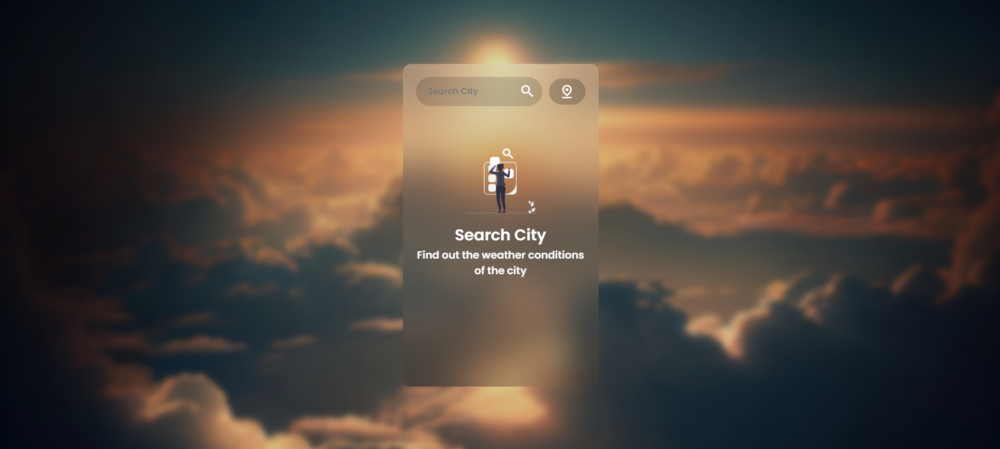

# Weather Web App

A responsive web app that displays weather conditions based on user input. Built using HTML, CSS, and JavaScript.

## Features
- Real-time weather display
- City-based search
- Interactive icons for various weather conditions

## Preview

## How to Run
Just open `index.html` in your browser — no server required!

## Folder Structure
- `index.html`: main HTML file
- `script.js`: handles API calls and interactions
- `style.css`: styling
- `assets/`: icons and background images
